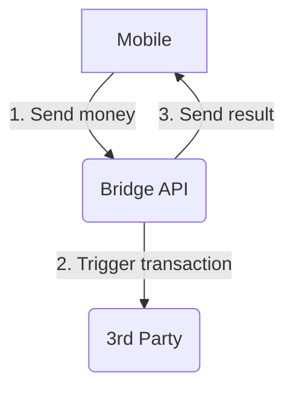

# Bridge for Long Latency Third Party

## Context



A mobile application will call Bridge API, and in turn it'll have to call an external service. If the transfer worked, Bridge API will have to notify the mobile application of the success, otherwise, of the failure.

### 3rd party's constraints

As mentionned before, our partners have a number issues, and this one has its share:

- it does not return immediatly if it worked, or not
- it takes a long time to answer (up to 10s)
- it is supposed to call bridge back through a webhook -- but sometimes it doesn't
- it has a status check API -- but they explicitely said they could block our services if we request it too often
- it will time out (HTTP 504) from time to time, but sometimes the request actually will go through after a longer time (up to 120s).

## Structure

You can start the project easily by running `docker-compose up -d`. This will start a mock for the 3rd party service and for the client application. We encourage to take a look at the different READMEs to understand the global picture.

```
.
├── docker-compose.yml
├── README.md
├── client
│   └── README.md
├── thirdpartymock
│   └── README.md
└── your_api
    └── README.md
```

If you want to perform some tests after your docker-compose is up, you can run the following cURL:

```
curl -H 'Content-Type: application/json' -X POST localhost:3100/transaction
```

This will ask the client application to trigger a transaction creation. Which in turn will call Bridge API.
